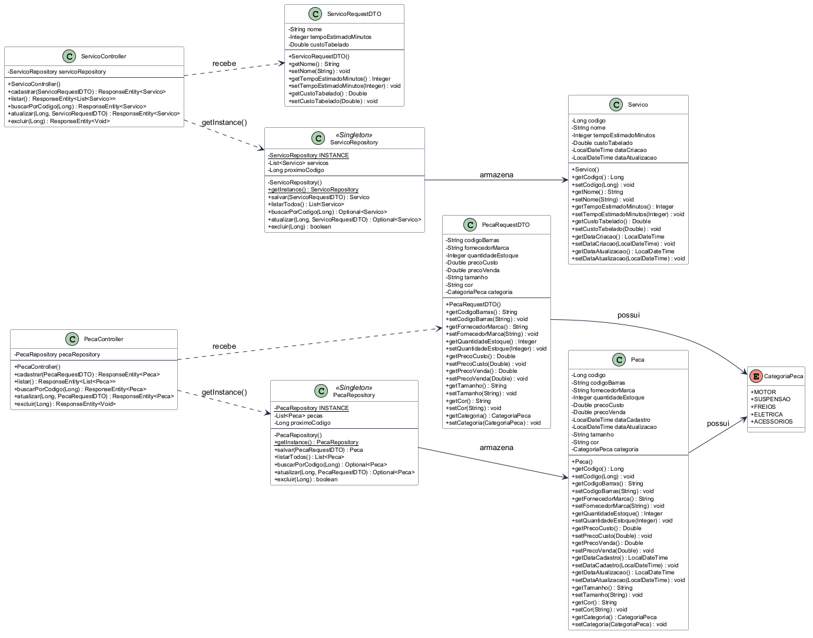

# MecaniQA — Web API Fundacional (OAT 1)

> **Equipe:** São Luiz  
> **Disciplina:** Desenvolvimento Web Orientado a Objetos (UniFTC)  
> **Professor / Avaliador:** Prof. Dr. Lucas Almeida Silva (`lasilva`)  
> **Prazo do Entregável Técnico:** 29/08/2026  

---

## Sobre o Projeto

A **MecâniQA API** é uma solução de backend construída com **Java e Spring Boot** para o gerenciamento de catálogos de autopeças e tabelas de serviços automotivos. 

O projeto segue integralmente as restrições arquiteturais da **OAT 1**, priorizando o domínio prático da Programação Orientada a Objetos em memória sem o uso de bancos de dados relacionais ou injeção automática de dependências[cite: 8].

---

## Restrições Arquiteturais e Decisões de Engenharia

* **Persistência 100% em Memória:** Não utiliza bancos de dados físicos, instâncias embarcadas (H2/SQLite) ou interfaces Spring Data JPA[cite: 8].
* **Isolamento de Injeção de Dependência:** Proibido o uso de `@Autowired`, `@Component` ou `@Repository` gerenciados pelo framework Spring nos repositórios[cite: 8].
* **Padrão de Projeto Singleton Manual:** Classes de repositório (`PecaRepository` e `ServicoRepository`) implementadas com construtor `private`, atributo `private static NomeRepository INSTANCE` e método de acesso global `public static synchronized NomeRepository getInstance()`[cite: 8, 9].
* **Controle de Concorrência (Thread-Safety):** Métodos de escrita, geração sequencial de identificadores e mutação de listas internas utilizam o modificador `synchronized`[cite: 8].
* **Semântica REST com `ResponseEntity`:** Todos os métodos dos controladores manipulam explicitamente os códigos de status HTTP (`201 Created`, `200 OK`, `204 No Content` e `404 Not Found`)[cite: 8, 9].
* **Isolamento de Entrada com DTOs:** Uso de `PecaRequestDTO` e `ServicoRequestDTO` para receber dados externos sem expor atributos de controle gerados pela aplicação (`codigo`, `dataCadastro`, `dataCriacao` e `dataAtualizacao`)[cite: 8, 9].

---

## Diagrama de Classes UML

O diagrama abaixo apresenta o modelo estrutural de classes da API MecâniQA, contendo modificadores de visibilidade, tipagem explícita e mapeamento do padrão Singleton[cite: 8, 9]:



Arquivos de especificação:
* PlantUML: [`docs/diagrama-classes.puml`](docs/diagrama-classes.puml)[cite: 8]
* Mermaid.js: [`docs/diagrama-classes.md`](docs/diagrama-classes.md)[cite: 8]

---

## Mapeamento de Endpoints (User Stories US01 a US08)

### Catálogo de Peças (`/api/pecas`)

| Método | Endpoint | Status HTTP | Descrição / User Story |
| :--- | :--- | :---: | :--- |
| `POST` | `/api/pecas` | `201 Created` | **US01:** Cadastrar nova peça com categoria vinculada[cite: 8] |
| `GET` | `/api/pecas` | `200 OK` | **US02:** Listar todas as peças cadastradas[cite: 8] |
| `GET` | `/api/pecas/{codigo}` | `200 OK` / `404 Not Found` | **US02:** Buscar peça pelo código identificador[cite: 8] |
| `PUT` | `/api/pecas/{codigo}` | `200 OK` / `404 Not Found` | **US03:** Atualizar dados, estoques e preços de uma peça[cite: 8] |
| `DELETE` | `/api/pecas/{codigo}` | `204 No Content` / `404 Not Found` | **US04:** Excluir registro de peça do catálogo[cite: 8] |

### Tabela de Serviços (`/api/servicos`)

| Método | Endpoint | Status HTTP | Descrição / User Story |
| :--- | :--- | :---: | :--- |
| `POST` | `/api/servicos` | `201 Created` | **US05:** Cadastrar novo serviço automotivo[cite: 8] |
| `GET` | `/api/servicos` | `200 OK` | **US06:** Listar todos os serviços disponíveis[cite: 8] |
| `GET` | `/api/servicos/{codigo}` | `200 OK` / `404 Not Found` | **US06:** Buscar serviço por código identificador[cite: 8] |
| `PUT` | `/api/servicos/{codigo}` | `200 OK` / `404 Not Found` | **US07:** Atualizar tempo estimado e custo tabelado[cite: 8] |
| `DELETE` | `/api/servicos/{codigo}` | `204 No Content` / `404 Not Found` | **US08:** Excluir serviço do portfólio[cite: 8] |

---

## Execução do Projeto

### Pré-requisitos
* Java JDK 17 ou superior instalado[cite: 8].
* Gradle Wrapper (incluso no projeto)[cite: 8].

### Comandos de Inicialização

1. Clonar o repositório oficial:
   ```bash
   git clone [https://github.com/hellennverenaa/mecaniQA-api-sao-luiz.git](https://github.com/hellennverenaa/mecaniQA-api-sao-luiz.git)
   cd mecaniQA-api-sao-luiz
