# Diagrama de Classes UML - MecaniQA (OAT 1)

## Visão Geral da Arquitetura

O diagrama abaixo representa a estrutura de classes oficial da API MecâniQA (Equipe São Luiz), modelada de acordo com as especificações da OAT 1 e as diretrizes do Barema Oficial.

```mermaid
classDiagram
    direction TB

    class CategoriaPeca {
        <<enumeration>>
        +MOTOR
        +SUSPENSAO
        +FREIOS
        +ELETRICA
        +ACESSORIOS
    }

    class Peca {
        -Long codigo
        -String nome
        -String codigoBarras
        -String fornecedorMarca
        -Integer quantidadeEstoque
        -Double precoCusto
        -Double precoVenda
        -CategoriaPeca categoria
        -String tamanho
        -String cor
        -LocalDateTime dataCadastro
        -LocalDateTime dataAtualizacao
        +Peca()
        +Peca(Long codigo, String nome, String codigoBarras, String fornecedorMarca, Integer quantidadeEstoque, Double precoCusto, Double precoVenda, CategoriaPeca categoria, String tamanho, String cor, LocalDateTime dataCadastro, LocalDateTime dataAtualizacao)
        +getCodigo() Long
        +setCodigo(Long codigo) void
        +getNome() String
        +setNome(String nome) void
        +getCodigoBarras() String
        +setCodigoBarras(String codigoBarras) void
        +getFornecedorMarca() String
        +setFornecedorMarca(String fornecedorMarca) void
        +getQuantidadeEstoque() Integer
        +setQuantidadeEstoque(Integer quantidadeEstoque) void
        +getPrecoCusto() Double
        +setPrecoCusto(Double precoCusto) void
        +getPrecoVenda() Double
        +setPrecoVenda(Double precoVenda) void
        +getCategoria() CategoriaPeca
        +setCategoria(CategoriaPeca categoria) void
        +getTamanho() String
        +setTamanho(String tamanho) void
        +getCor() String
        +setCor(String cor) void
        +getDataCadastro() LocalDateTime
        +setDataCadastro(LocalDateTime dataCadastro) void
        +getDataAtualizacao() LocalDateTime
        +setDataAtualizacao(LocalDateTime dataAtualizacao) void
    }

    class Servico {
        -Long codigo
        -String nome
        -Integer tempoEstimadoMinutos
        -Double custoTabelado
        -LocalDateTime dataCriacao
        -LocalDateTime dataAtualizacao
        +Servico()
        +Servico(Long codigo, String nome, Integer tempoEstimadoMinutos, Double custoTabelado, LocalDateTime dataCriacao, LocalDateTime dataAtualizacao)
        +getCodigo() Long
        +setCodigo(Long codigo) void
        +getNome() String
        +setNome(String nome) void
        +getTempoEstimadoMinutos() Integer
        +setTempoEstimadoMinutos(Integer tempoEstimadoMinutos) void
        +getCustoTabelado() Double
        +setCustoTabelado(Double custoTabelado) void
        +getDataCriacao() LocalDateTime
        +setDataCriacao(LocalDateTime dataCriacao) void
        +getDataAtualizacao() LocalDateTime
        +setDataAtualizacao(LocalDateTime dataAtualizacao) void
    }

    class PecaRequestDTO {
        -String nome
        -String codigoBarras
        -String fornecedorMarca
        -Integer quantidadeEstoque
        -Double precoCusto
        -Double precoVenda
        -CategoriaPeca categoria
        -String tamanho
        -String cor
        +PecaRequestDTO()
        +PecaRequestDTO(String nome, String codigoBarras, String fornecedorMarca, Integer quantidadeEstoque, Double precoCusto, Double precoVenda, CategoriaPeca categoria, String tamanho, String cor)
        +getNome() String
        +setNome(String nome) void
        +getCodigoBarras() String
        +setCodigoBarras(String codigoBarras) void
        +getFornecedorMarca() String
        +setFornecedorMarca(String fornecedorMarca) void
        +getQuantidadeEstoque() Integer
        +setQuantidadeEstoque(Integer quantidadeEstoque) void
        +getPrecoCusto() Double
        +setPrecoCusto(Double precoCusto) void
        +getPrecoVenda() Double
        +setPrecoVenda(Double precoVenda) void
        +getCategoria() CategoriaPeca
        +setCategoria(CategoriaPeca categoria) void
        +getTamanho() String
        +setTamanho(String tamanho) void
        +getCor() String
        +setCor(String cor) void
    }

    class ServicoRequestDTO {
        -String nome
        -Integer tempoEstimadoMinutos
        -Double custoTabelado
        +ServicoRequestDTO()
        +ServicoRequestDTO(String nome, Integer tempoEstimadoMinutos, Double custoTabelado)
        +getNome() String
        +setNome(String nome) void
        +getTempoEstimadoMinutos() Integer
        +setTempoEstimadoMinutos(Integer tempoEstimadoMinutos) void
        +getCustoTabelado() Double
        +setCustoTabelado(Double custoTabelado) void
    }

    class PecaRepository {
        -PecaRepository INSTANCE$
        -List~Peca~ pecas
        -Long proximoCodigo
        -PecaRepository()
        +getInstance()$ PecaRepository
        +salvar(PecaRequestDTO dto) Peca
        +listarTodos() List~Peca~
        +buscarPorCodigo(Long codigo) Optional~Peca~
        +atualizar(Long codigo, PecaRequestDTO dto) Optional~Peca~
        +excluir(Long codigo) boolean
    }

    class ServicoRepository {
        -ServicoRepository INSTANCE$
        -List~Servico~ servicos
        -Long proximoCodigo
        -ServicoRepository()
        +getInstance()$ ServicoRepository
        +salvar(ServicoRequestDTO dto) Servico
        +listarTodos() List~Servico~
        +buscarPorCodigo(Long codigo) Optional~Servico~
        +atualizar(Long codigo, ServicoRequestDTO dto) Optional~Servico~
        +excluir(Long codigo) boolean
    }

    class PecaController {
        -PecaRepository pecaRepository
        +PecaController()
        +cadastrar(PecaRequestDTO dto) ResponseEntity~Peca~
        +listar() ResponseEntity~List~Peca~~
        +buscarPorCodigo(Long codigo) ResponseEntity~Peca~
        +atualizar(Long codigo, PecaRequestDTO dto) ResponseEntity~Peca~
        +excluir(Long codigo) ResponseEntity~Void~
    }

    class ServicoController {
        -ServicoRepository servicoRepository
        +ServicoController()
        +cadastrar(ServicoRequestDTO dto) ResponseEntity~Servico~
        +listar() ResponseEntity~List~Servico~~
        +buscarPorCodigo(Long codigo) ResponseEntity~Servico~
        +atualizar(Long codigo, ServicoRequestDTO dto) ResponseEntity~Servico~
        +excluir(Long codigo) ResponseEntity~Void~
    }

    %% Relacionamentos
    Peca --> "1" CategoriaPeca : categoria
    PecaRequestDTO --> "1" CategoriaPeca : categoria

    PecaRepository o-- Peca : gerencia
    ServicoRepository o-- Servico : gerencia

    PecaController ..> PecaRepository : utiliza
    PecaController ..> PecaRequestDTO : recebe
    PecaController ..> Peca : retorna

    ServicoController ..> ServicoRepository : utiliza
    ServicoController ..> ServicoRequestDTO : recebe
    ServicoController ..> Servico : retorna

    PecaRepository ..> PecaRequestDTO : consome
    ServicoRepository ..> ServicoRequestDTO : consome
```

