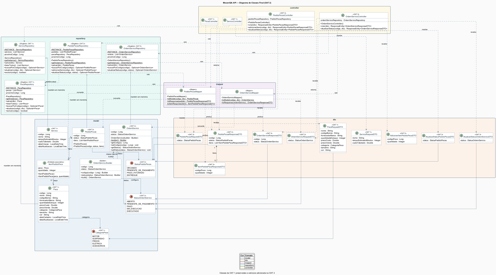
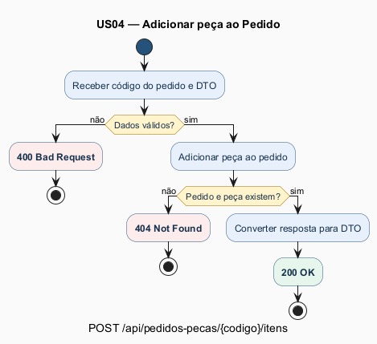

# Diagramas da OAT 2

Esta pasta preserva os diagramas da OAT 1 e documenta a implementação final da OAT 2.

## Diagrama de Classes

O arquivo `diagrama-classes.puml` mantém as partes necessárias da OAT 1 e acrescenta:

- `OrdemServico`, `PedidoPecas` e `ItemPedidoPeca`;
- `StatusOrdemServico` e `StatusPedidoPecas`;
- `OrdemServico.Builder` e seu relacionamento com `OrdemServico`;
- DTOs de entrada e saída;
- `OrdemServicoMapper` e `PedidoPecasMapper`;
- repositories Singleton em memória;
- controllers da OAT 2 recebendo e retornando DTOs.

## Diagrama de Atividade

O arquivo `diagrama-atividade.puml` representa somente a visão lógica do método
`PedidoPecasController.adicionarItem`, associado à US04:

`POST /api/pedidos-pecas/{codigo}/itens`

O fluxo contém:

- validação do DTO;
- `400 Bad Request` para dados inválidos;
- `404 Not Found` quando pedido ou peça não são encontrados;
- conversão para `PedidoPecasResponseDTO`;
- `200 OK` no caminho de sucesso.

O diagrama não representa repository, banco de dados ou detalhes de infraestrutura.

## Arquivos disponíveis

- `.puml`: fonte editável em PlantUML;
- `.svg`: imagem vetorial para documentos e apresentações;
- `.png`: visualização pronta para consulta e entrega.
